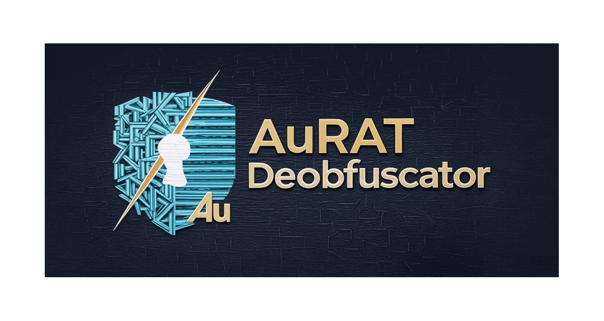
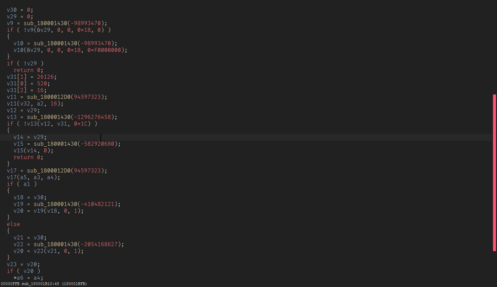
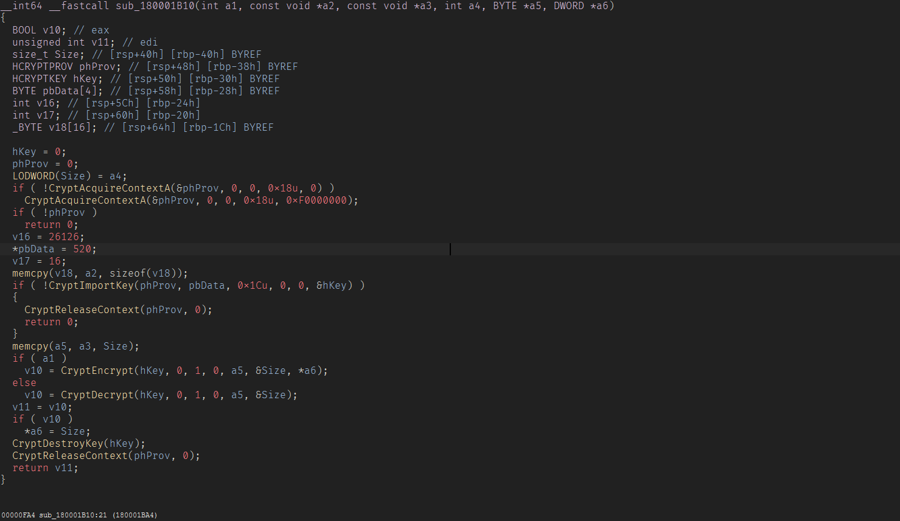

<p align="center">
  
</p>

<h1 align="center">Static Deobfuscator - AuRAT</h1>


After analyzing **AuRAT** I discoverd that contains **Dynamic API Resolution Obfuscation**  where each library has its own dedicated resolver thats resolve function by its own hash
- `kernel32` -> `0x180001000`
- `user32`  -> `0x180001160`
- `msvcrt`  -> `0x1800012D0`
- `advapi32`  -> `0x180001430`
- `Wtsapi32`  -> `0x180001590`
- `ws2_32`    -> `0x180001850`

there are also some special resolvers that returns specific function

- `HeapAlloc` -> `0x1800010B0`
- `wsprintfA`  -> `0x180001160`
- `IsUserAnAdmin`  -> `0x1800016F0`
- `GetUserProfileDirectoryA`  -> `0x1800019B0`

Based on this analysis i developed this **Static Deobfuscator** based on **Pattern Matching** to identify the the obfuscated API calls and deobfuscate this and make it direct call to the API

> [!Note]
> **This deobfuscator can work with any sample from this malware family you just need to update the resolvers addresses.**

# Before

<p align="center">
  
</p>


# After

<p align="center">
  
</p>


# Installation

```
git clone https://github.com/0xilovebits/AuRAT-Deobfuscator
cd AuRAT-Deobfuscator
pip install -r requirements.txt
```